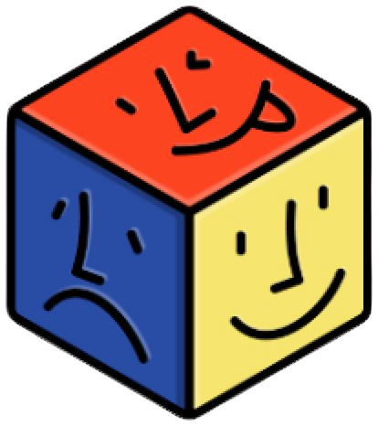

# Tout Va Bien

**Tout Va Bien** est une plateforme web interactive destinée aux jeunes. Ce projet vise à aider les adolescents à identifier les signes de violence psychologique, physique ou de négligence dans un cadre familial ou scolaire. En les sensibilisant et en les orientant vers des ressources adaptées, cette application a pour but de contribuer à leur bien-être et à leur sécurité.

Initialement conçu pour les femmes, le projet a été adapté pour répondre aux besoins des jeunes en difficulté, notamment scolaires. Le site se veut intuitif, avec un design attractif et des questionnaires rigoureux pour maximiser son impact.

---

## Sommaire

1. [Prérequis](#prérequis)
2. [Installation](#installation)
3. [Lancement de l'application](#lancement-de-lapplication)

## Prérequis

Avant de commencer, assurez-vous d'avoir :
- Un IDE ou un éditeur de texte comme VS Code
- Node.js installé (version recommandée : 16.x ou supérieure)
- npm (Node Package Manager) fourni avec Node.js

## Installation

> Clonez le dépôt sur votre machine locale

```
git clone https://github.com/JeCode667/ToutVaBien.git
```

> Accédez au répertoire du projet

```
cd ToutVaBien
```

> Installez les dépendances

```
npm install
```

## Lancement de l'application

> Construisez le projet pour production

```
npm run build
```

> Lancez l'application en mode développement

```
npm start
```

**L'application sera accessible sur http://localhost:3000.**

